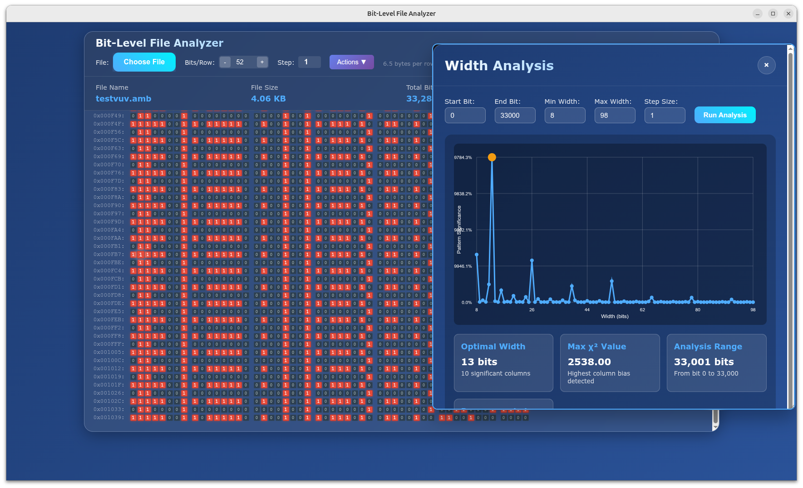

# Bit-Level File Analyser

> **Note: This application and all text below this line is the result of Vibe Coding with claude.ai**

A powerful web-based tool for analysing binary files at the bit level, built using modern vibe coding techniques with AI assistance. This tool provides visual bit representation, pattern analysis, and advanced editing capabilities for reverse engineering and binary analysis tasks.

## ✨ Features

- **Visual Bit Display**: View files as binary grids with customisable width settings
- **Real-time Analysis**: Interactive bit selection and information display
- **Pattern Matching**: Search for specific binary sequences
- **Statistical Analysis**: Column bias detection and optimised width finding
- **Bit Editing**: Transform binary data using command sequences
- **Virtual Scrolling**: Efficient rendering for large files
- **Export Capabilities**: Download analysis results and modified data

## 🚀 Getting Started

1. Clone this repository
2. Open `bitanalyser.html` in a modern web browser
3. Click "Choose File" to load any binary file
4. Explore the visualisation and use the action tools

## 🛠️ Action Tools

### 📊 Find Width
Analyses column bias patterns across different display widths to identify optimal viewing configurations. This tool:
- Performs chi-squared statistical tests on each column
- Calculates significance scores for pattern detection
- Generates interactive charts showing bias distribution
- Recommends optimised width settings for revealing hidden structures
- Helps identify data alignment and formatting patterns

### 🔍 Find Patterns  
Searches for specific binary sequences within the file. Features include:
- Binary pattern matching with customisable search ranges
- Configurable search step sizes for performance optimisation
- Visual highlighting of matches in the main display
- Context display showing surrounding bits
- Export functionality for match locations and analysis
- Extraction tools for isolating matched patterns

### ✏️ Edit Bits
Applies transformation commands to modify binary data. Command syntax:
- `t7` = Take 7 bits (copy to output)
- `s4` = Skip 4 bits (ignore in processing)  
- `i01011` = Insert bit sequence "01011"
- `n3` = Invert 3 bits (flip 0→1, 1→0)
- Commands can be chained: `t7s4i01011n3`
- Supports pattern repetition across specified ranges
- Preview functionality with before/after comparison
- Export edited data as binary files with analysis reports

## 🎯 Vibe Coding Approach

This tool was developed using vibe coding principles, where natural language prompts guided AI-assisted development. The interface prioritises intuitive interaction over complex menus, allowing users to explore binary data through visual patterns and interactive analysis.

## 📁 File Support

Supports any binary file format including:
- Executable files (.exe, .bin, .elf)
- Images (.jpg, .png, .gif)
- Documents (.pdf, .doc)
- Archives (.zip, .tar)
- Custom binary formats

## 🌐 Browser Compatibility

- Chrome/Edge 80+
- Firefox 75+
- Safari 13+
- Modern mobile browsers

## 💡 Use Cases

- Reverse engineering binary file formats
- Cryptanalysis and pattern detection
- Data recovery and corruption analysis
- Security research and malware analysis
- Educational exploration of binary data structures

